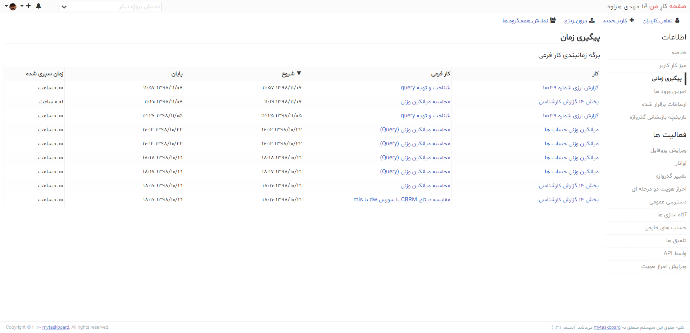
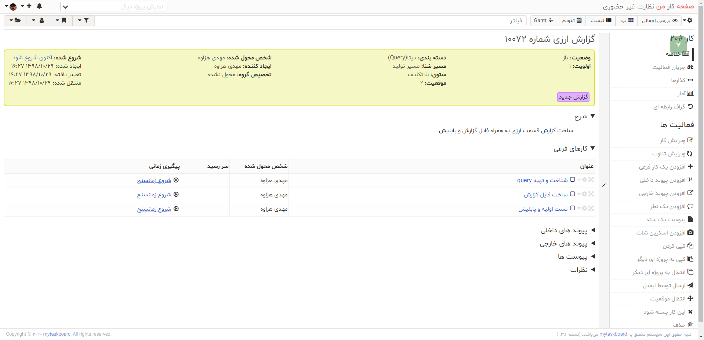

# Kanboard-1.2.13 mod 1.3.1
Customize Kanboard 1.2.13 (RTL + Persian Language)

Website
------
https://kanboard.org/

Author
------
- Frédéric Guillot
    - Mod by Mahdi Hezaveh
  
Credits
-------

- Main developer: Frédéric Guillot
- [Contributors](https://github.com/kanboard/kanboard/graphs/contributors)
- Distributed under [MIT License](https://github.com/kanboard/kanboard/blob/master/LICENSE)
-------
Installation
-------
- import mytaskboard.sql
- config db setting (root folder -> config.php)

      // Database driver: sqlite, mysql or postgres (sqlite by default)
      define('DB_DRIVER', 'mysql');

      // Mysql/Postgres username
      define('DB_USERNAME', 'root');

      // Mysql/Postgres password
      define('DB_PASSWORD', 'root');

      // Mysql/Postgres hostname
      define('DB_HOSTNAME', 'localhost');

      // Mysql/Postgres database name
      define('DB_NAME', 'mytaskboard');

- login
  
      user: admin
      pass: 123456

-------

-------

-------

-------

-------

-------

-------

-------

-------

-------

-------

-------

-------

-------

